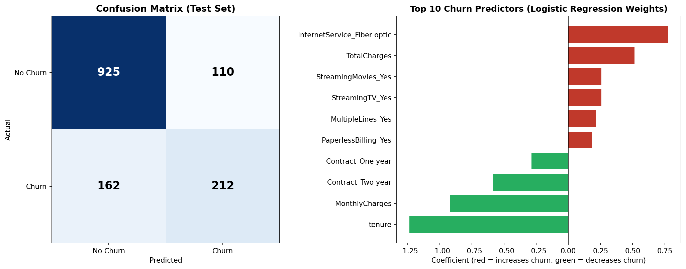
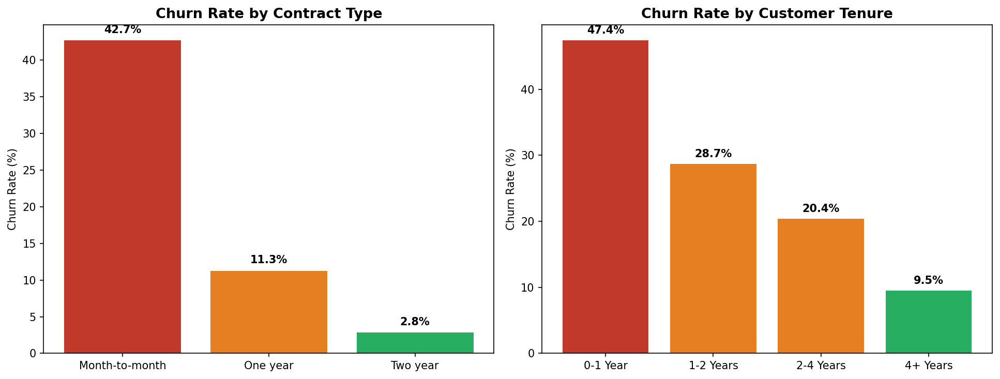

Customer Churn Prediction and Analysis
End-to-end churn analysis project: performed EDA and customer segmentation on 7,043 telecom subscription records using Python and SQL, then built and evaluated a logistic regression model to predict churn.
Model Results

Segmentation Insights

Tools Used
Python (Pandas, Scikit-learn, Matplotlib, Seaborn) — data cleaning, EDA, modeling, visualization
SQL (SQLite) — customer segmentation queries
SciPy — statistical significance testing (chi-square, point-biserial correlation)
Key Insights
Overall churn rate: 26.5% across 7,043 customers
Month-to-month contracts have by far the highest churn (42.7%) vs. one-year (11.3%) and two-year (2.8%) contracts
The highest-risk segment — month-to-month customers in their first year — has a 51.4% churn rate (1,994 customers)
Contract type, tenure, and lack of tech support/online security are the strongest, statistically significant churn predictors (p < 0.001)
Model Performance
Metric	Value
Baseline accuracy (majority class)	73.5%
Logistic Regression accuracy	80.7%
Precision (churn class)	65.8%
Recall (churn class)	56.7%
ROC-AUC	0.842
Retention Strategy
Reducing the highest-risk segment's churn rate from 51.4% to 37.3% (a 14-point improvement, achievable through contract-upgrade incentives for new month-to-month customers) would translate to a 15% reduction in overall company-wide churn.
Files in this Repository
File	Description
`telco.csv`	Raw dataset (IBM Telco Customer Churn)
`telco_cleaned.csv`	Cleaned dataset
`01_clean_churn_data.py`	Data cleaning script
`02_run_sql_analysis.py`	SQL segmentation analysis
`03_logistic_regression.py`	Model training and evaluation
`04_generate_charts.py`	Chart generation
`sql_results.txt`	Saved SQL query outputs
`model_evaluation.txt`	Saved model evaluation summary
`churn_segmentation.png`	Segmentation chart
`model_results.png`	Confusion matrix + feature importance chart
Dataset
IBM Telco Customer Churn dataset (7,043 customers, 21 features).
